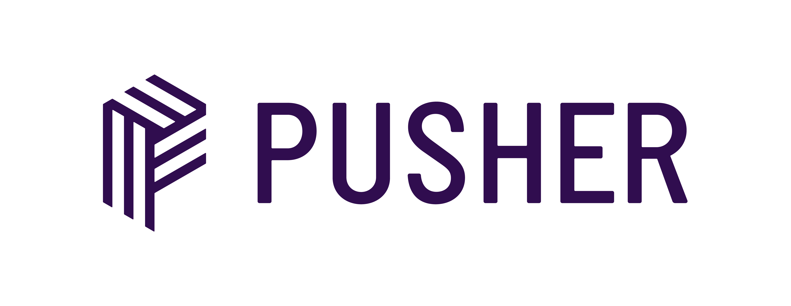

# Auto-assistant

It is a simple medical assistant created by using technologies like vite, pusher, supabase and open AI.
The goal is automate suggestions and notify users according their diseases. This project has been designed rapidly, whereby it isn't completely done and may have some troubles.  

### Development process

| Usage                  | Command        |
| ---------------------- | -------------- |
| Install dependencies   | `pnpm install` |
| Running in development | `pnpm dev:<app,hub,bot>`     |

> ⚠️ Keep in mind you need to use pnpm and node >= 16.0